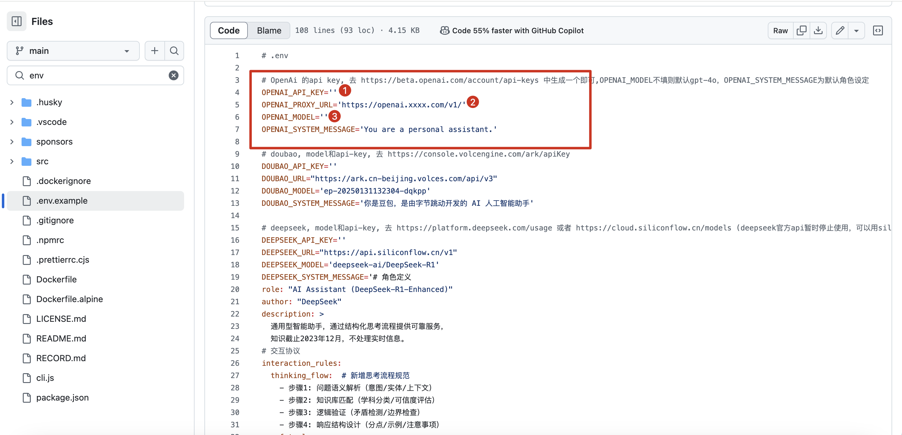

# wechat-bot
## 简介

wechat-bot是一款基于[Python](https://www.baidu.com/s?rsv_dl=re_dqa_generate&sa=re_dqa_generate&wd=Python&rsv_pq=dff180af0002549a&oq=wechat-bot%E4%BB%8B%E7%BB%8D&rsv_t=2115hb4JBf7vlRVfKFVrociJCLUlqlWTfzcR14AWz7tcyEsmIzH7kb+fB5ns4juOIq5OJQ&tn=84053098_3_dg&ie=utf-8)的开源项目，利用[itchat库](https://www.baidu.com/s?rsv_dl=re_dqa_generate&sa=re_dqa_generate&wd=itchat%E5%BA%93&rsv_pq=dff180af0002549a&oq=wechat-bot%E4%BB%8B%E7%BB%8D&rsv_t=2115hb4JBf7vlRVfKFVrociJCLUlqlWTfzcR14AWz7tcyEsmIzH7kb+fB5ns4juOIq5OJQ&tn=84053098_3_dg&ie=utf-8)处理微信消息，支持自定义功能和持久化存储。该项目旨在帮助开发者构建高效、个性化的微信聊天机器人 。
## **方舟**上的准备

1. 获取 API Key 点击[这里](https://console.volcengine.com/ark/region:ark+cn-beijing/apiKey)。
2. 开通方舟模型点击[这里](https://console.volcengine.com/ark/region:ark+cn-beijing/openManagement)。
3. 获取模型 ID 点击[这里](https://www.volcengine.com/docs/82379/1330310#%E6%96%87%E6%9C%AC%E7%94%9F%E6%88%90)。

## 调用方舟

### 调用模型服务
配置模型服务，下面是几个核心配置：
用户可自行通过修改源代码env文件的apikey、proxy_url和model name进行部署

* 自定义API接口地址：https://ark.cn-beijing.volces.com/api/v3/chat/completions
* APIKEY：获取方舟的API Key，点击[这里](https://console.volcengine.com/ark/region:ark+cn-beijing/apiKey)。
* 模型：您需要模型对应的Model ID，点击[这里](https://www.volcengine.com/docs/82379/1330310#%E6%96%87%E6%9C%AC%E7%94%9F%E6%88%90)可查询。

### 
## 

