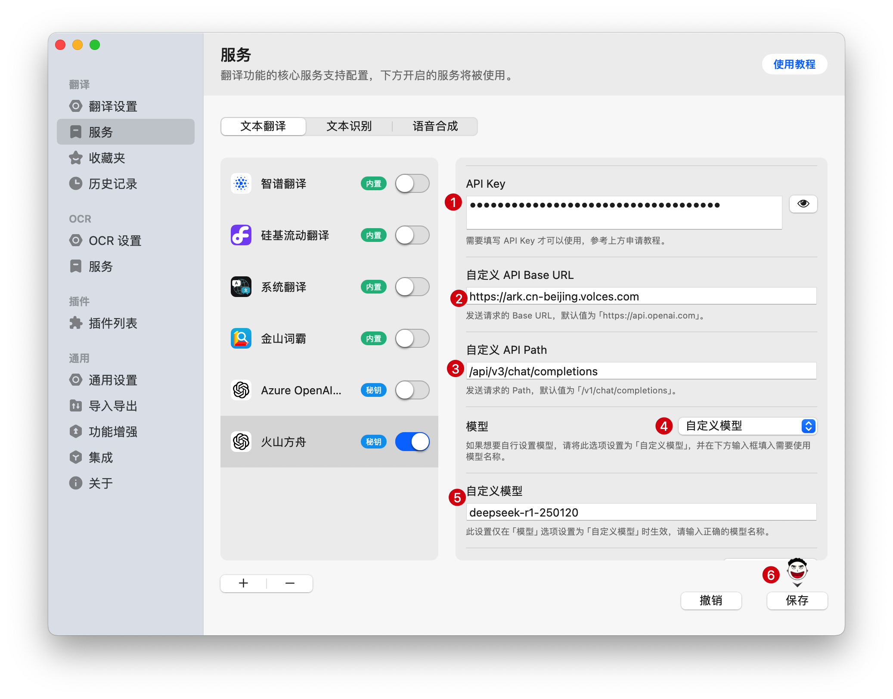
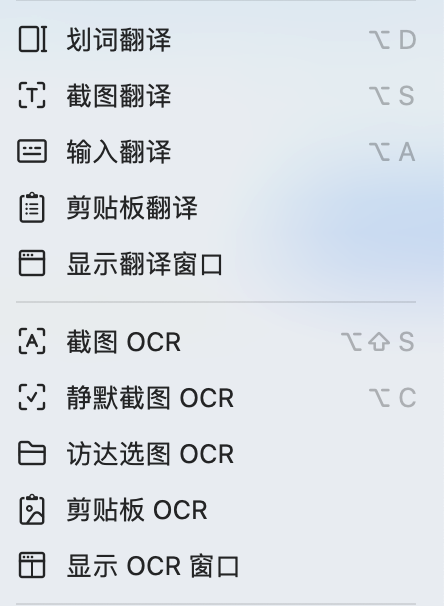
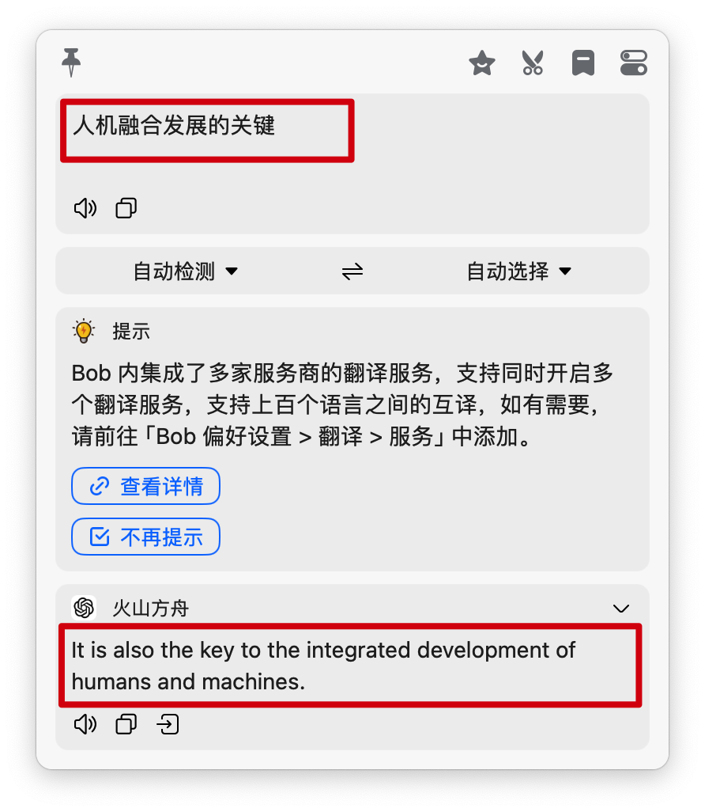

# Bob
## 简介

https://bobtranslate.com/
Bob，一款专为 macOS 平台打造的强大翻译与 OCR 软件。无论您正在使用何种应用程序，只需轻松操作，Bob 便能即时响应，为您提供精准翻译与高效 OCR 服务。它秉持即用即走的设计理念，让您的翻译与文字识别需求，在简单、快捷、高效的体验中轻松实现 。
## **方舟**上的准备

1. 获取 API Key 点击[这里](https://console.volcengine.com/ark/region:ark+cn-beijing/apiKey)。
2. 开通方舟模型点击[这里](https://console.volcengine.com/ark/region:ark+cn-beijing/openManagement)。
3. 获取模型 ID 点击[这里](https://www.volcengine.com/docs/82379/1330310#%E6%96%87%E6%9C%AC%E7%94%9F%E6%88%90)。

## 调用方舟

### 调用模型服务
配置模型服务，下面是几个核心配置：

* 自定义API接口地址：https://ark.cn-beijing.volces.com/api/v3/chat/completions
* APIKEY：获取方舟的API Key，点击[这里](https://console.volcengine.com/ark/region:ark+cn-beijing/apiKey)。
* 模型：您需要模型对应的Model ID，点击[这里](https://www.volcengine.com/docs/82379/1330310#%E6%96%87%E6%9C%AC%E7%94%9F%E6%88%90)可查询。

### 
## 使用技巧

### 划词/截图快捷键翻译
选中需要翻译的词句，按下快捷键即可进行。或者使用快捷键截图后翻译图片内容
> 选中词句后按下`⌥+D`即可快速翻译；按下截图翻译快捷键`⌥+S`即可翻译图片区域内容；按下输入翻译快捷键`⌥+A`输入需要翻译的文本，Enter键翻译。

### 启用大模型翻译
配置好大模型后进行翻译请求，等待几秒钟即可翻译成功。
> 支持20+大模型以及10+翻译服务。

