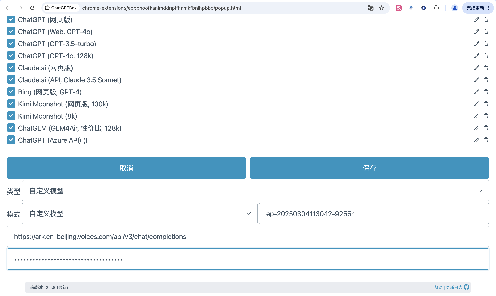
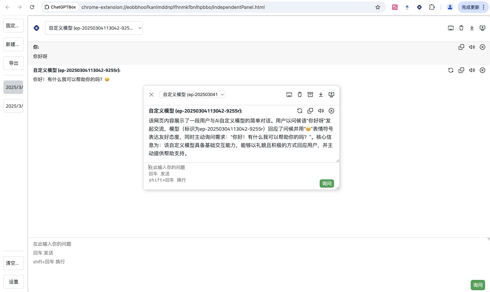

# ChatGPT Box
## 简介 
 
https://chromewebstore.google.com/detail/chatgptbox/eobbhoofkanlmddnplfhnmkfbnlhpbbo
一款深度集成 ChatGPT 的浏览器插件，支持多平台实时对话、网页总结、翻译等 AI 功能，提供多 API 支持和自定义配置，适用于高效办公与智能交互场景。
## **方舟**上的准备 
 

1. 获取 API Key 点击[这里](https://console.volcengine.com/ark/region:ark+cn-beijing/apiKey)。 
2. 开通方舟模型点击[这里](https://console.volcengine.com/ark/region:ark+cn-beijing/openManagement)。 
3. 获取模型 ID 点击[这里](https://www.volcengine.com/docs/82379/1330310#%E6%96%87%E6%9C%AC%E7%94%9F%E6%88%90)。 

## 调用方舟 
 
### 调用模型服务 
配置模型服务，下面是几个核心配置：

* 模型：您需要模型对应的Model ID，点击[这里](https://www.volcengine.com/docs/82379/1330310#%E6%96%87%E6%9C%AC%E7%94%9F%E6%88%90)可查询。 
* 接口地址：[https://ark.cn-beijing.volces.com/api/v3/chat/completions](https://ark.cn-beijing.volces.com/api/v3/chat/completions)
* 密钥：获取方舟的API Key，点击[这里](https://console.volcengine.com/ark/region:ark+cn-beijing/apiKey)。 

## 使用技巧 
 
### 使用ChatGPTBox在网页中随时唤起聊天对话框
点击浏览器扩展栏，将沉浸式导读插件固定在浏览器上方，可随时（Ctrl+B）在任意页面唤起聊天对话框，支持静态卡片浮窗多分支对话、保存或复制聊天记录。
> ChatGPTBox支持多种API，集成常用网站和主流搜索引擎，还具备选择工具和右键菜单可执行翻译、总结等多种任务。

