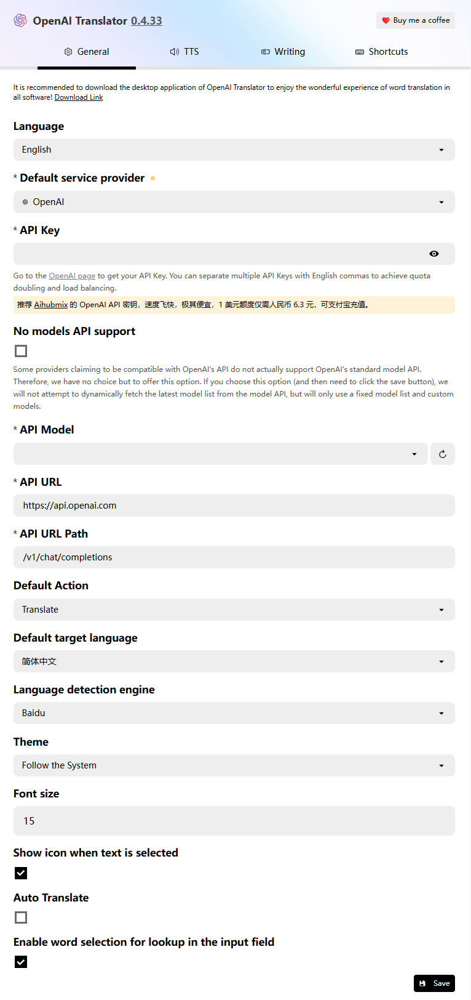

## OpenAI Translator

github地址：https://github.com/openai-translator/openai-translator

一款即用即走的翻译、OCR工具

## **方舟**上的准备

1. 获取 API Key 点击[这里](https://console.volcengine.com/ark/region:ark+cn-beijing/apiKey)。
2. 开通方舟模型点击[这里](https://console.volcengine.com/ark/region:ark+cn-beijing/openManagement)。
3. 获取模型 ID 点击[这里](https://www.volcengine.com/docs/82379/1330310#%E6%96%87%E6%9C%AC%E7%94%9F%E6%88%90)。

## 部署及调用方舟

1. 在浏览器插件商城中下载OpenAI Translator
2. 打开设置，下面是几个核心配置：

- API key：获取方舟的API Key，点击[这里](https://console.volcengine.com/ark/region:ark+cn-beijing/apiKey)。
- API Model：Custom
- Custom Model Name：您需要模型对应的Model ID，点击[这里](https://www.volcengine.com/docs/82379/1330310#文本生成)可查询。
- API Provider ：OpenAI
- API URL：https://ark.cn-beijing.volces.com/api/v3/
- API URL Path：/v3/chat/competion

## 使用技巧

按需求翻译/润色/总结/分析文本