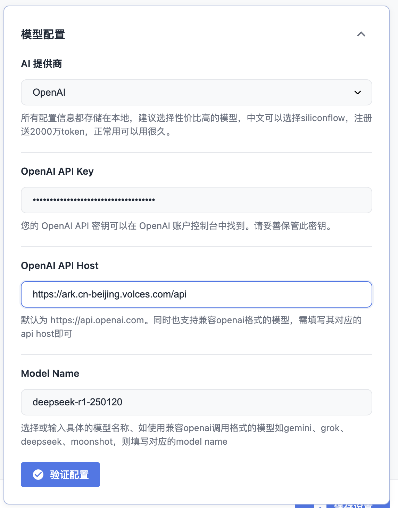

# RssFlow
## 简介

 https://chromewebstore.google.com/detail/mefbfkpippglgoanjcbdjnkelcbdjija?utm_source=item-share-cb
RSS Flow 是一款现代智能 RSS 阅读器，具备 RSS 一键订阅与智能更新、多模型 AI 摘要（可自定义、离线读）、多维阅读视图、智能工具箱（全文搜索等）及个性化设置（暗黑模式等）。支持主流格式，数据本地存，免费使用，适合多种人群，在 Chrome 简单配置即可开启智能阅读。

## 方舟上的准备

1. 获取 API Key 点击[这里](https://console.volcengine.com/ark/region:ark+cn-beijing/apiKey)。
2. 开通方舟模型点击[这里](https://console.volcengine.com/ark/region:ark+cn-beijing/openManagement)。
3. 获取模型 ID 点击[这里](https://www.volcengine.com/docs/82379/1330310#%E6%96%87%E6%9C%AC%E7%94%9F%E6%88%90)。

## 调用方舟

### 调用模型服务
配置模型服务，下面是几个核心配置：

* Open AI API Host：https://ark.cn-beijing.volces.com/api
* OpeniAI API Key：获取方舟的API Key，点击[这里](https://console.volcengine.com/ark/region:ark+cn-beijing/apiKey)。
* Model Name：您需要模型对应的Model ID，点击[这里](https://www.volcengine.com/docs/82379/1330310#%E6%96%87%E6%9C%AC%E7%94%9F%E6%88%90)可查询
