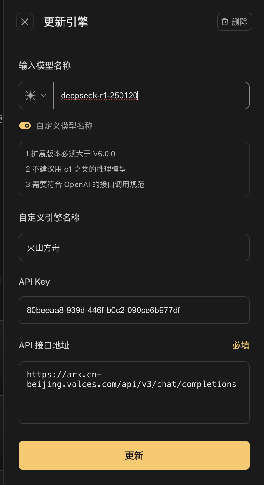
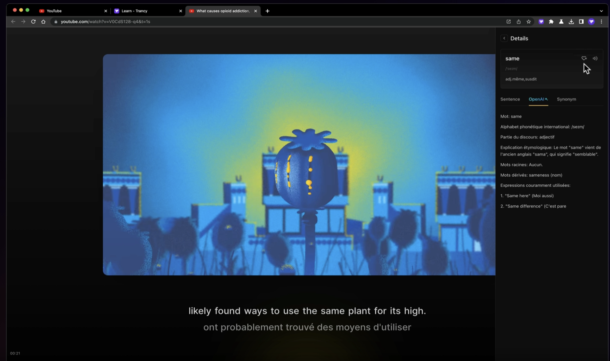

# Trancy
## 简介

 https://learn.trancy.org/home
一款专为语言学习者设计的全能工具，除了支持YouTube/Netflix双语字幕，Trancy还提供了网页AI划词翻译和全文翻译等功能，可以巧妙地将内容转化为用户自己的语言学习资料。借助Trancy，可以体验高效且有趣的沉浸式语言学习。

## 方舟上的准备

1. 获取 API Key 点击[这里](https://console.volcengine.com/ark/region:ark+cn-beijing/apiKey)。
2. 开通方舟模型点击[这里](https://console.volcengine.com/ark/region:ark+cn-beijing/openManagement)。
3. 获取模型 ID 点击[这里](https://www.volcengine.com/docs/82379/1330310#%E6%96%87%E6%9C%AC%E7%94%9F%E6%88%90)。

## 调用方舟

### 调用模型服务
配置模型服务，下面是几个核心配置：

* 输入模型名称：您需要模型对应的Model ID，点击[这里](https://www.volcengine.com/docs/82379/1330310#%E6%96%87%E6%9C%AC%E7%94%9F%E6%88%90)可查询。
* API Key：https://ark.cn-beijing.volces.com/api/v3
* API接口地址：获取方舟的API Key，点击[这里](https://console.volcengine.com/ark/region:ark+cn-beijing/apiKey)。

### 
## 使用技巧

### 使用Trancy实现 Youtube/Netflix AI 双语字幕
在 YouTube、Netflix、HBO Max、TED、edX、Coursera 等平台，找你自己感兴趣的视频，借助于 Trancy 提供的 AI 双语字幕功能，快速的理解视频内容，在看懂的基础上练习听力和口语，一举两得。

 
