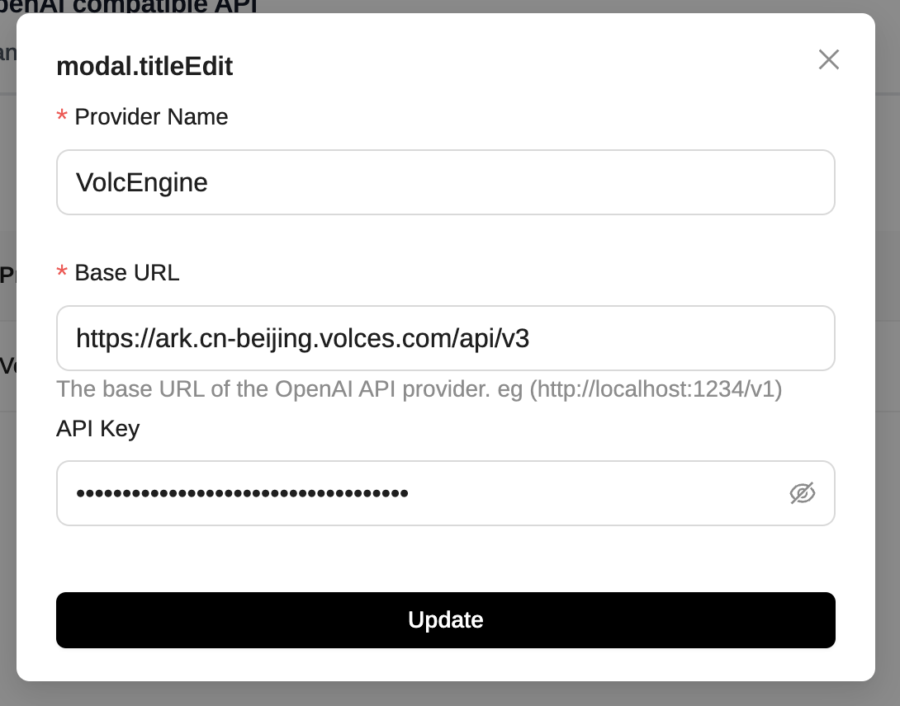

# page-assist
## 简介

https://chromewebstore.google.com/detail/page-assist-a-web-ui-for/jfgfiigpkhlkbnfnbobbkinehhfdhndo?hl=en
一款在 Chrome、Firefox 等多浏览器可用的浏览器插件，能使用本地 AI 模型（如 Ollama、Gemini Nano 等）辅助上网，有侧边栏和 Web UI，能搜索、与网页或文档聊天，数据本地存储，支持多格式文件，且持续开发迭代 。

## **方舟**上的准备

1. 获取 API Key 点击[这里](https://console.volcengine.com/ark/region:ark+cn-beijing/apiKey)。
2. 开通方舟模型点击[这里](https://console.volcengine.com/ark/region:ark+cn-beijing/openManagement)。
3. 获取模型 ID 点击[这里](https://www.volcengine.com/docs/82379/1330310#%E6%96%87%E6%9C%AC%E7%94%9F%E6%88%90)。

## 调用方舟

### 调用模型服务
配置模型服务，下面是几个核心配置：

* Base URL：https://ark.cn-beijing.volces.com/api/v3
* API Key：获取方舟的API Key，点击[这里](https://console.volcengine.com/ark/region:ark+cn-beijing/apiKey)。

