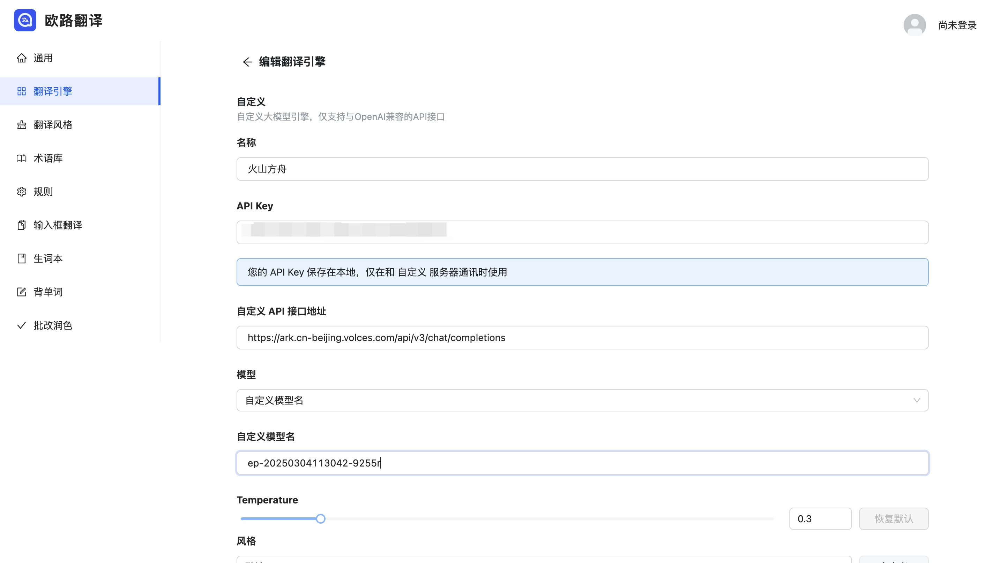
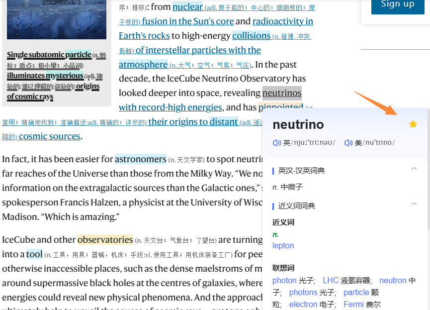

# 欧路翻译
## 简介 
 
https://chromewebstore.google.com/detail/djbfechcnkppbknmlhfcaoifgnicolin?utm_source=item-share-cb
一款支持划词搜索、逐段对照及 PDF 翻译的多引擎浏览器插件，兼容欧路词典同步学习记录，持续更新并新增自定义大模型与多文档格式支持。
## **方舟**上的准备 
 

1. 获取 API Key 点击[这里](https://console.volcengine.com/ark/region:ark+cn-beijing/apiKey)。 
2. 开通方舟模型点击[这里](https://console.volcengine.com/ark/region:ark+cn-beijing/openManagement)。 
3. 获取模型 ID 点击[这里](https://www.volcengine.com/docs/82379/1330310#%E6%96%87%E6%9C%AC%E7%94%9F%E6%88%90)。 

## 调用方舟 
 
### 调用模型服务 
配置模型服务，下面是几个核心配置：

* API Key：获取方舟的API Key，点击[这里](https://console.volcengine.com/ark/region:ark+cn-beijing/apiKey)。 
* 自定义API接口地址：[https://ark.cn-beijing.volces.com/api/v3/chat/completions](https://ark.cn-beijing.volces.com/api/v3/chat/completions)
* 自定义模型名：模型对应的接入点 ID

## 使用技巧 

### 使用欧路翻译完成划词搜索
点击浏览器扩展栏，将划词翻译插件固定在浏览器上方，点击图标即可对所选单词进行双语对照翻译，沉浸式阅读外文网站。 
> 划词后，可以将生词一键加入生词本，欧路翻译插件会同步你的生词本和背单词，随时查看和复习单词，稳步积累。

