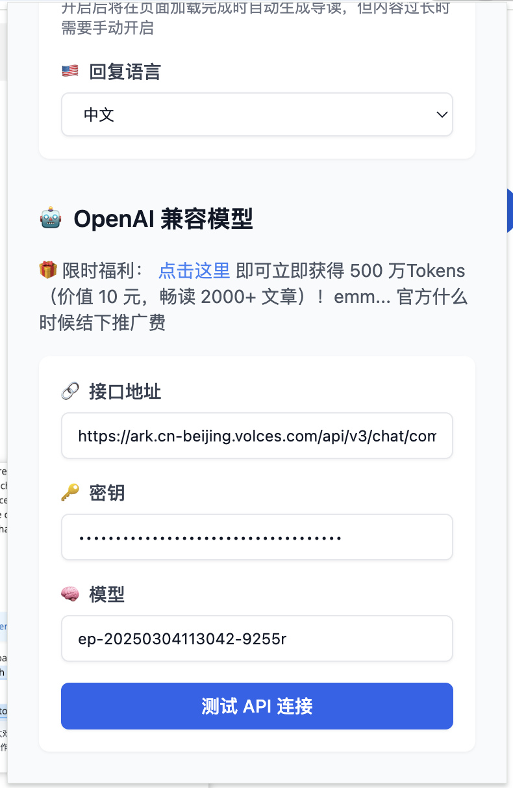
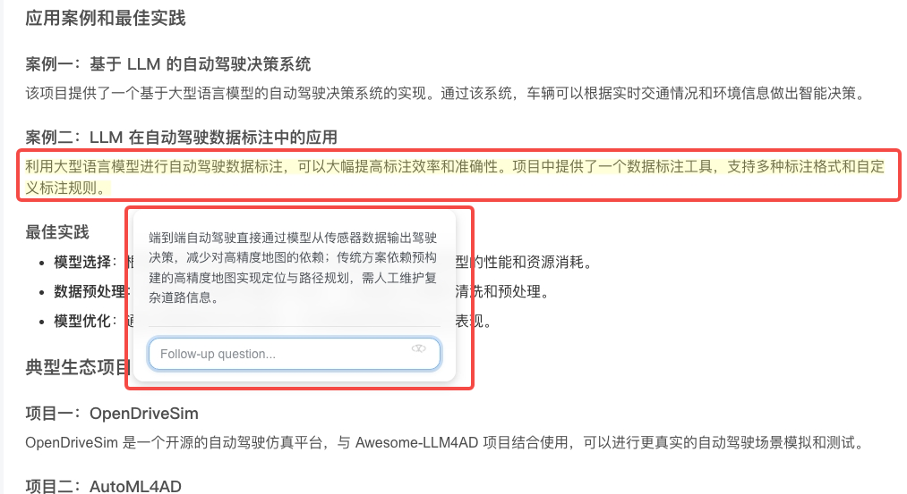

# 沉浸式导读
## 简介 
 
https://chromewebstore.google.com/detail/jnjhalaghogaleoidplmjhjnemmakffp?utm_source=item-share-cb
一款 AI 驱动的网页阅读助手，通过实时引导解读、知识导图和智能批注，帮助用户高效理解文章内容，支持自定义模型，界面简洁，适合专业阅读和学习场景。
## **方舟**上的准备 
 

1. 获取 API Key 点击[这里](https://console.volcengine.com/ark/region:ark+cn-beijing/apiKey)。 
2. 开通方舟模型点击[这里](https://console.volcengine.com/ark/region:ark+cn-beijing/openManagement)。 
3. 获取模型 ID 点击[这里](https://www.volcengine.com/docs/82379/1330310#%E6%96%87%E6%9C%AC%E7%94%9F%E6%88%90)。 

## 调用方舟 
 
### 调用模型服务 
配置模型服务，下面是几个核心配置：

* 接口地址：[https://ark.cn-beijing.volces.com/api/v3/chat/completions](https://ark.cn-beijing.volces.com/api/v3/chat/completions)
* 密钥：获取方舟的API Key，点击[这里](https://console.volcengine.com/ark/region:ark+cn-beijing/apiKey)。 
* 模型：您需要模型对应的Model ID，点击[这里](https://www.volcengine.com/docs/82379/1330310#%E6%96%87%E6%9C%AC%E7%94%9F%E6%88%90)可查询。 

## 使用技巧 
 
### 使用沉浸式导读在网页中划词自由提问 
点击浏览器扩展栏，将沉浸式导读插件固定在浏览器上方，支持在网页中划选文字提问，并能提供基于全文语境的精准回答，随时解答阅读中的疑惑。
> 沉浸式导读还提供智能导读、AI目录导航、智能批注等功能，高度可定制的功能非常适合需要快速理解文章的读者。

