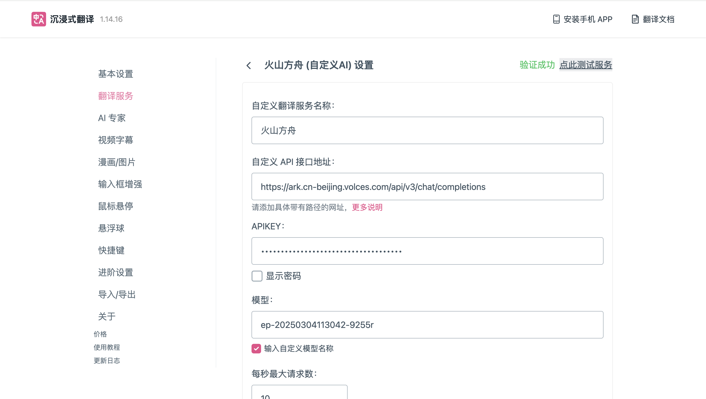
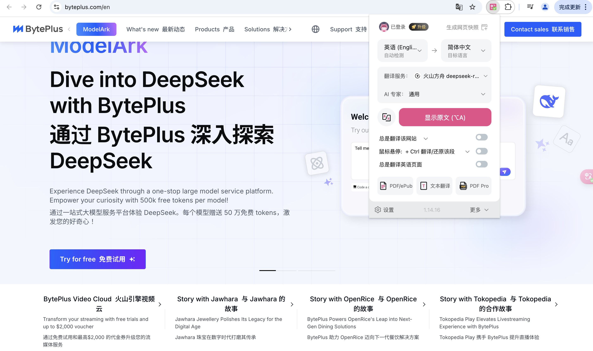
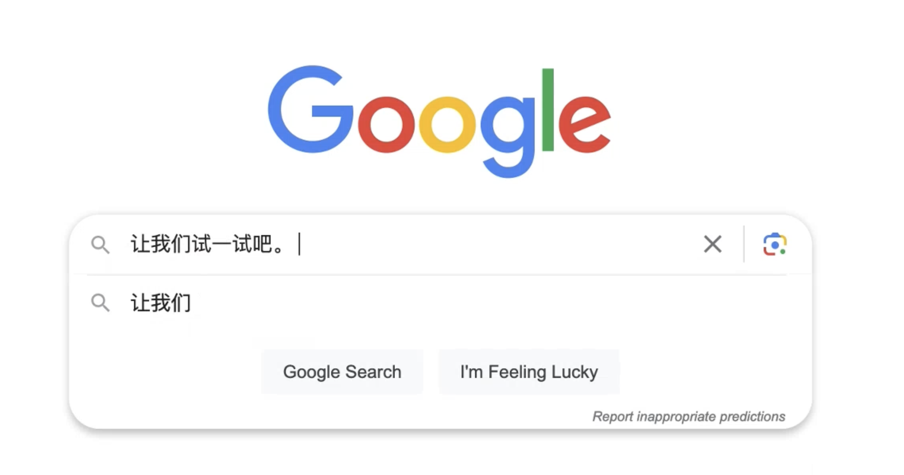

# 沉浸式翻译
## 简介

https://immersivetranslate.com/zh-Hans/
一款支持网页、PDF、EPUB 电子书及视频双语字幕实时翻译的免费插件，提供跨平台（手机 / 电脑）沉浸式双语阅读体验，帮助用户打破语言壁垒，高效获取全球信息。
## **方舟**上的准备

1. 获取 API Key 点击[这里](https://console.volcengine.com/ark/region:ark+cn-beijing/apiKey)。
2. 开通方舟模型点击[这里](https://console.volcengine.com/ark/region:ark+cn-beijing/openManagement)。
3. 获取模型 ID 点击[这里](https://www.volcengine.com/docs/82379/1330310#%E6%96%87%E6%9C%AC%E7%94%9F%E6%88%90)。

## 调用方舟

### 调用模型服务
配置模型服务，下面是几个核心配置：

* 自定义API接口地址：https://ark.cn-beijing.volces.com/api/v3/chat/completions
* APIKEY：获取方舟的API Key，点击[这里](https://console.volcengine.com/ark/region:ark+cn-beijing/apiKey)。
* 模型：您需要模型对应的Model ID，点击[这里](https://www.volcengine.com/docs/82379/1330310#%E6%96%87%E6%9C%AC%E7%94%9F%E6%88%90)可查询。

### 
## 使用技巧

### 使用沉浸式翻译进行网站双语对照翻译
点击浏览器扩展栏，将沉浸式翻译插件固定在浏览器上方，点击图标即可对网站进行双语对照翻译，沉浸式阅读外文网站。
> 沉浸式翻译扩展支持很多翻译服务，通过添加兼容OpenAI接口的自定义AI翻译服务，即可按需使用。

### 使用沉浸式翻译进行输入框翻译
在任何输入框里输入中文后，快速连击3次空格键，即可将输入框内容翻译成英文。
> `ja 输入中文`即可翻译为日语， ` fr 输入中文`即可翻译为法语。其他语言类似，请参考官网的所有语言代码和命令。

* 翻译前：

* 翻译后：

