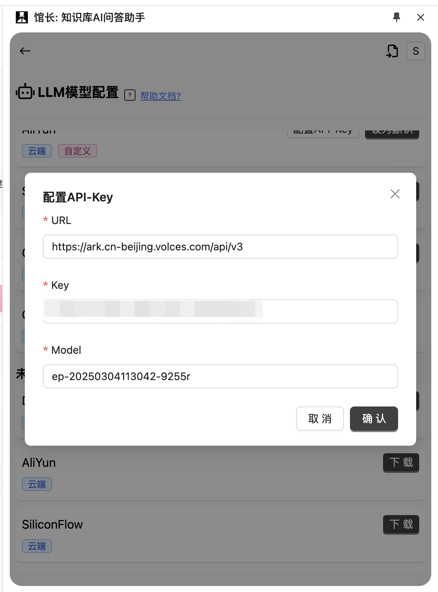

# 馆长
## 简介

https://www.ncurator.com/zh
一款革新性的开源浏览器翻译插件，能带来母语般阅读体验，支持 20 余种包括传统及 AI 大模型的翻译引擎（如微软、谷歌、DeepL、OpenAI 等），具备双语对照功能，有丰富自定义选项可满足多样场景需求。
## **方舟**上的准备

1. 获取 API Key 点击[这里](https://console.volcengine.com/ark/region:ark+cn-beijing/apiKey)。
2. 开通方舟模型点击[这里](https://console.volcengine.com/ark/region:ark+cn-beijing/openManagement)。
3. 获取模型 ID 点击[这里](https://www.volcengine.com/docs/82379/1330310#%E6%96%87%E6%9C%AC%E7%94%9F%E6%88%90)。

## 调用方舟

### 调用模型服务
配置模型服务，下面是几个核心配置：

* 自定义API接口地址：https://ark.cn-beijing.volces.com/api/v3
* APIKEY：获取方舟的API Key，点击[这里](https://console.volcengine.com/ark/region:ark+cn-beijing/apiKey)。
* 模型：您需要模型对应的接入点ID。
